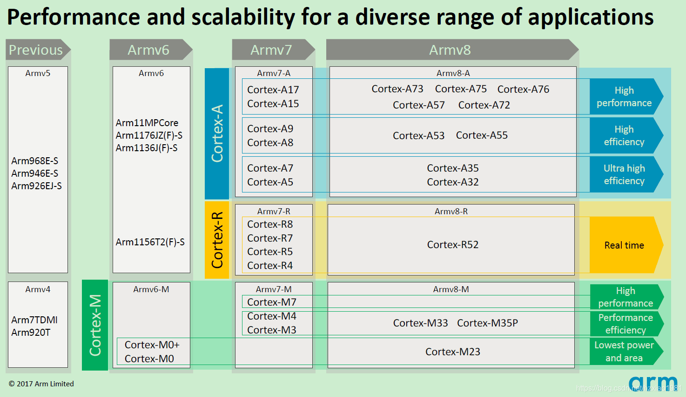

# ODROID-GO-ADVANCE 2.0 开源掌机 BSP 说明 

## 简介 

ODROID-GO-ADVANCE 2.0（简称OGA2，下文均使用简称）开源掌机是一块原理图、芯片手册、uboot、linux kernel 均开源的游戏掌机。

该 BSP 使用的 AARCH64 模式进行对接。

该 BSP 仅供娱乐，欢迎各位大佬尝试移植各种驱动和应用，本人为鸽子王随时可能鸽。

如果觉得该还有点点帮助的话，麻烦给颗星星~

## 外观

掌机外观如下图所示：

## 板载资源 

该开发板常用 **板载资源** 如下：

- A: Processor : 
  - CPU : RockChip RK3326(Quad-Core ARM Cortex-A35 1.3GHz) 
  - GPU : Mali-G31 Dvalin

- B: RAM : 1GB (DDR3L 786Mhz, 32 Bits bus width)
- C: SPI Flash (16Mbytes Boot)
- D: MicroSD card slot 
- E: Forced SD card boot (without spirom)
- F: UART port (But not mounted default) 
- G: Speaker connector
- H: Battery connector
- I: USB 2.0 type-A Host
- J: Statue LED (charger, alive, power)
- K: USB-C power Jack
- L: 10pin expansion port
- M: Audio jack
- N: 20pin LCD connector
- O: PWR switch
- P: Analog joystick connector
- Q: Left trigger button
- R: Right trigger button
- S: Wireless module ESP-WROOM-S2 

- A: PMIC(RK817) including a charger and audio features
- B: D-pad buttons
- C: I ~ VI buttons (F1, F2, F3, F4, F5, F6)
- D: X, Y, A, B buttons
- E: Trigger Left2
- F: Trigger Right2

## RK3326 架构图 

## RK3326 SDCARD 分区表 

http://opensource.rock-chips.com/wiki_Partitions

https://blog.csdn.net/linglongqiongge/article/details/52262660

